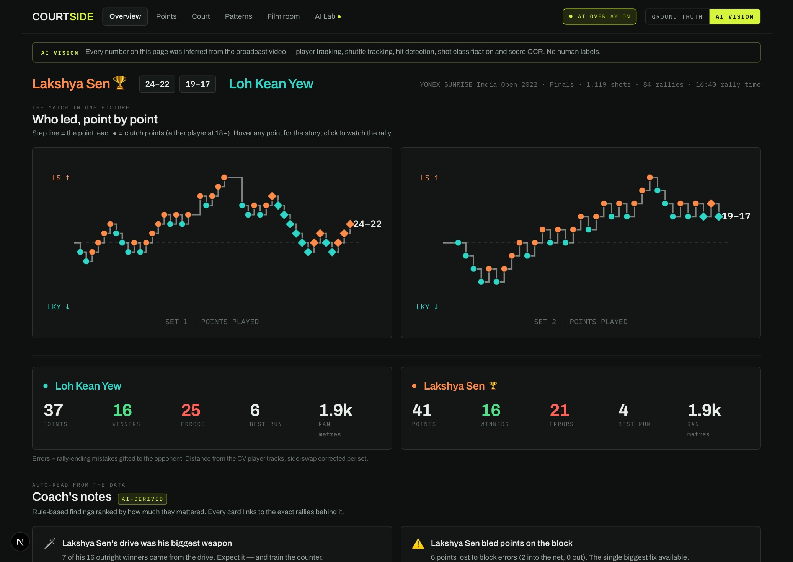
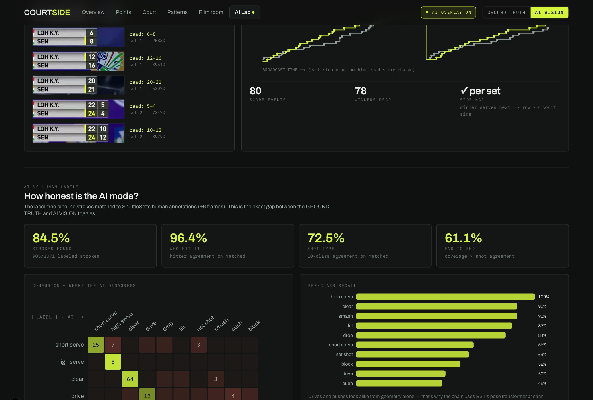
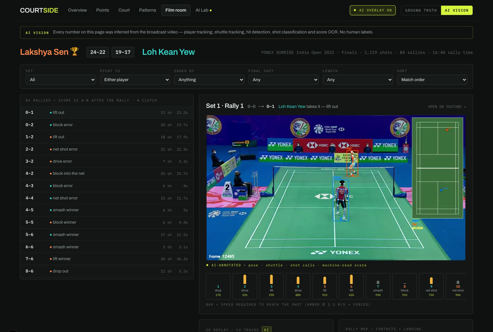

# COURTSIDE — badminton match intelligence from raw broadcast video

**An end-to-end computer-vision system that watches a badminton broadcast and writes the
scouting report.** It tracks both players and the shuttle, detects every hit, classifies
every shot, reads the scoreboard, segments rallies — then turns that into a coach-grade
analytics dashboard with AI-annotated video for every rally. **No human labels at
inference time**, and every stage is validated against professionally annotated ground
truth, including on a fully held-out match.



> Everything on that page — the score worm, the stats, the coach's notes — was inferred
> from pixels. Flip the same dashboard to **GROUND TRUTH** (human labels) to compare; the
> gap between the two is measured and published on the AI Lab page.

## Pipeline accuracy

Thresholds were tuned on one match (India Open 2022 final) and tested untouched on a
second (Denmark Open 2022 SF) — the held-out column is true out-of-distribution
performance. Ground truth: ShuttleSet22 human annotations.

| Stage | Method | Tuned match | Held-out match |
|---|---|---|---|
| Player tracking → court metres | YOLO11x-pose + ByteTrack + homography | **0.57 m** median (1,058 strokes) | 0.64 m |
| Shuttle tracking | TrackNetV3 (vendored, MPS-patched) | **99.8%** of labeled hit points | — |
| Hit detection | velocity-kink ∪ direction-reversal ∪ serve-onset detectors | **F1 87.9** | F1 85.8 |
| Hitter attribution | nearest tracked wrist | **90.0%** | 94.5% |
| Landing position | trajectory floor point → homography | **0.55 m** median | 1.12 m |
| Shot classification (10 classes) | pretrained BST-0 (CVPRW'26) at *detected* hits, zero fine-tuning | **72.5%** | 83.4% |
| Rally segmentation | camera-run detection + dead-shuttle restart splitting | **F1 97.6** | F1 94.0 |
| Score OCR | template-matched 12 px digits (self-bootstrapped from labels, transfers across tournaments) | **95.2%** score trajectory | 97.3% |
| Per-set side mapping | "winner serves next" voting | **4/4** sets | 4/4 sets |

End-to-end, the label-free chain reproduces 84.5% / 79.5% of labeled strokes with ~96%
hitter agreement — enough that the *same* analytics code produces near-identical coach
insights from either source.

## What the dashboard does with it

Static Next.js app in [`web/`](web/) (TypeScript, Tailwind, bespoke SVG charts — no chart
library; deploys to Vercel as pure static files):

- **Overview** — interactive score worm, stat duel, auto-generated *coach's notes* where
  every claim deep-links to its evidence rallies, plus an LLM-written match report.
- **Points / Court / Patterns** — winners and errors by shot, rally-length win rates, serve & receive,
  shot placement maps, movement heatmaps (side-swap corrected), pressure model
  (required movement speed), forced/unforced errors, and two scouting tables:
  the **response matrix** ("vs a net shot he lifts 52% — and wins only 41% of those")
  and the **opening playbook** (serve type → hold % → returns → server win % vs each).
- **Film room** — every rally filterable and watchable, with a synchronized **2D replay**
  animated from the CV tracks and a per-shot pressure strip.
- **AI overlay everywhere** — a persistent navbar toggle swaps all footage to
  pre-rendered annotated clips: pose skeletons, shuttle trail, BST shot calls with
  confidence, and the machine-read score, baked into the video.
- **AI Lab** — each pipeline stage with its measured accuracy, a rally
  "X-ray" (broadcast + 2D replay + raw shuttle trajectory with detected vs labeled hits),
  live score-OCR crops, and the BST-vs-labels confusion matrix.




## Doubles

Doubles is a separate, deletable surface (route `/d/<id>`, its own manifest and
components) so the singles chain stays untouched. There are no public doubles stroke
labels and identical kit defeats appearance re-ID, so the doubles pipeline leans on
**geometry and roles** instead of strokes: it tracks all four players (top-2 per court half,
stable identity slots), then derives — purely from the tracks — **formation** (attack =
front/back stack vs defence = side-by-side), **rotations**, per-player **net-hunting**,
**movement** heatmaps, and **label-free validation** (≈93% all-4 in-rally
coverage, identity stability, OCR parity). Five COURTSIDE views: Overview (+ rule-based
scouting notes), Court, Patterns (formation flow), Film room (4-player 2D replay), AI Lab.

The whole broadcast is tracked end to end, so the dashboard covers the **full multi-set
match**: set boundaries are read from the scoreboard OCR and the pairs' end-swaps between
games (and the deciding-game change at 11) are handled deterministically, so every stat
aggregates per **team** across all three sets. Runbook + design:
[`docs/DOUBLES.md`](docs/DOUBLES.md).

> Still gated on stroke-level data: shot mix, response matrix, openings, error pressure —
> these need 4-slot hit attribution (a Phase-1 item), not faked.

## Run it

**Web dashboard** (all data + clips are committed — runs from a fresh clone):

```bash
cd web && npm install && npm run dev     # http://localhost:3000
npm run build                            # static site in web/out — Vercel: root dir = web
```

**Python pipeline / Streamlit lab** (needs the local DuckDB + match video — see the
runbook below to build them):

```bash
python3.12 -m venv .venv && .venv/bin/pip install -r requirements.txt
PYTHONPATH=src .venv/bin/streamlit run app.py        # internal CV-diagnostics dashboard
PYTHONPATH=src .venv/bin/python -m badminton.<module>  # any pipeline stage as a CLI
```

**Add a match (data injection)** — the full runbook with both paths is
[`docs/ADD_A_MATCH.md`](docs/ADD_A_MATCH.md). The short version, for any broadcast video
with no labels:

```bash
# register in config/matches.yaml, fetch 720p video, calibrate 4 court corners, then:
PYTHONPATH=src .venv/bin/python scripts/parse_match.py --match <id> ...   # player tracks
PYTHONPATH=src .venv/bin/python -m badminton.shuttle <id>                 # shuttle track
PYTHONPATH=src .venv/bin/python -m badminton.pipeline <id> --label-free --write
PYTHONPATH=src .venv/bin/python -m badminton.labelfree <id> --build       # score OCR
PYTHONPATH=src .venv/bin/python scripts/render_web_clips.py --match <id>  # AI clips
PYTHONPATH=src .venv/bin/python -m badminton.export_web                   # → web/public/data
```

Parsed data is durable (DuckDB, keyed by `match_id`) — every stage runs once and is
cached forever.

## How it's built

```
broadcast.mp4 ──► YOLO11 pose + ByteTrack ──► tracks (court metres, validated ±0.57 m)
       │                                          │
       └──► TrackNetV3 ──► shuttle track ──► hit detection ──► BST-0 shot classes
                                │                 │
                       rally segmentation   landings (floor-point → homography)
                                │                 │
       score OCR ──► winners · sets · sides       │
                                └────────┬────────┘
                                  strokes table (= ShuttleSet schema, source='pipeline')
                                         │
                    insights.py / labelfree.py (pure pandas analytics)
                                         │
                         export_web.py ──► static JSON ──► web/ (Next.js)
```

The core design decision: **ShuttleSet's annotation format is the system's Tier-1
schema.** The CV pipeline's job is defined as *reproducing the human annotators' table* —
which gives free per-stage validation, and means the entire analytics layer was built and
debugged on ground truth before the vision pipeline existed.

- **Storage** — DuckDB, two tiers: `strokes` (one row per shot, superset of ShuttleSet) and
  `tracks`/`shuttle` (per-frame). One writer or many readers; writers batch at the end.
- **Stack** — Python 3.12 / PyTorch on Apple-silicon MPS, ultralytics, DuckDB, pandas,
  scikit-learn, OpenCV · Next.js 16 / TypeScript / Tailwind 4 · Gemini or Claude for the
  commentary layer (cached JSON, pluggable provider).
- **Video strategy** — analyzed videos are the official BWF YouTube uploads, so the web app
  embeds them at frame-accurate timestamps (zero hosting); the AI-annotated clips are
  rendered locally at 540p (~0.7 MB/rally) and shipped with the site.

## Credits / Prior Work

COURTSIDE builds on four pretrained third-party models, used **without fine-tuning**:
[Ultralytics YOLO11-Pose](https://github.com/ultralytics/ultralytics) (player pose),
[ByteTrack](https://arxiv.org/abs/2110.06864) (identity, via Ultralytics' bundled tracker),
[TrackNetV3](https://github.com/qaz812345/TrackNetV3) (shuttle trajectory — vendored and run
unmodified), and [BST-0](https://arxiv.org/abs/2502.21085) (*Badminton Stroke-type
Transformer*, Chang, CVPRW 2026). Ground truth and the Tier-1 data schema come from the
[ShuttleSet / ShuttleSet22](https://github.com/wywyWang/CoachAI-Projects) human annotations.
The runtime stack is PyTorch (Apple-silicon MPS), OpenCV, DuckDB, pandas, and scikit-learn,
with a static Next.js 16 / Tailwind front end (charts are hand-built SVG, no charting library).

Everything connecting those models is original work: the hit-detection, landing-estimation,
rally-segmentation, score-OCR, side-mapping, analytics, and dashboard stages, plus the
homography calibration, foot-point heuristic, MPS shims for the vendored models, the BST input
adapter, and the validation harness that scores each stage against ShuttleSet. Reported
accuracies split accordingly — player tracking (0.57 m) is third-party detection through my
court mapping; shot classification (72–83%) is BST-0's accuracy on my pipeline's inputs; hit
detection (F1 87.9), landings (0.55 m), rally segmentation (F1 97.6), and score OCR (95.2%)
are produced by original code.

**Licenses:** YOLO11/Ultralytics is **AGPL-3.0** (weights are gitignored, auto-downloaded — not
redistributed here); TrackNetV3 and BST are MIT (vendored with their LICENSE files). See
[`LICENSES/README.md`](LICENSES/README.md) before redistributing or deploying the pipeline as a
network service.

## Docs

| Doc | Contents |
|---|---|
| [`HANDOFF.md`](HANDOFF.md) | single entry point: status, module map, the hard-won gotchas |
| [`docs/DOUBLES.md`](docs/DOUBLES.md) | doubles workstream: 4-player tracking, formation/roles, full-match multi-set dashboard |
| [`docs/ADD_A_MATCH.md`](docs/ADD_A_MATCH.md) | runbook: inject a new match (labeled or label-free) |
| [`docs/DESIGN.md`](docs/DESIGN.md) · [`docs/SCHEMA.md`](docs/SCHEMA.md) | architecture & the two-tier data model |
| [`docs/PHASE0_RESULTS.md`](docs/PHASE0_RESULTS.md) | tracking validation methodology + results |
| [`docs/WEBAPP_DESIGN.md`](docs/WEBAPP_DESIGN.md) | every dashboard view & component, design rationale |
| [`docs/DATASETS.md`](docs/DATASETS.md) | ShuttleSet & friends, how to access |
