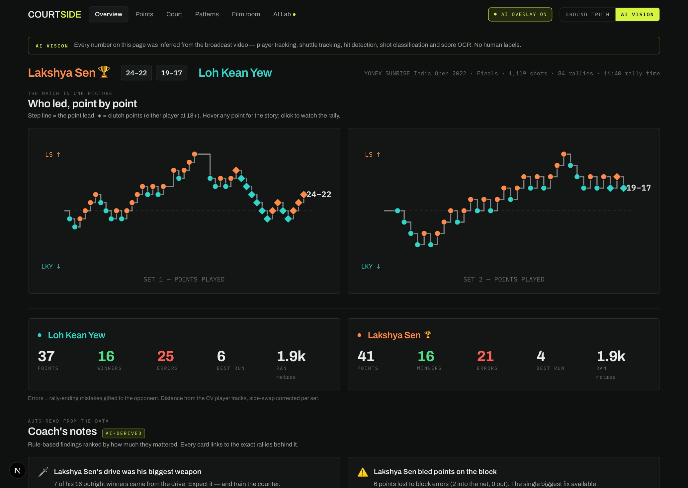
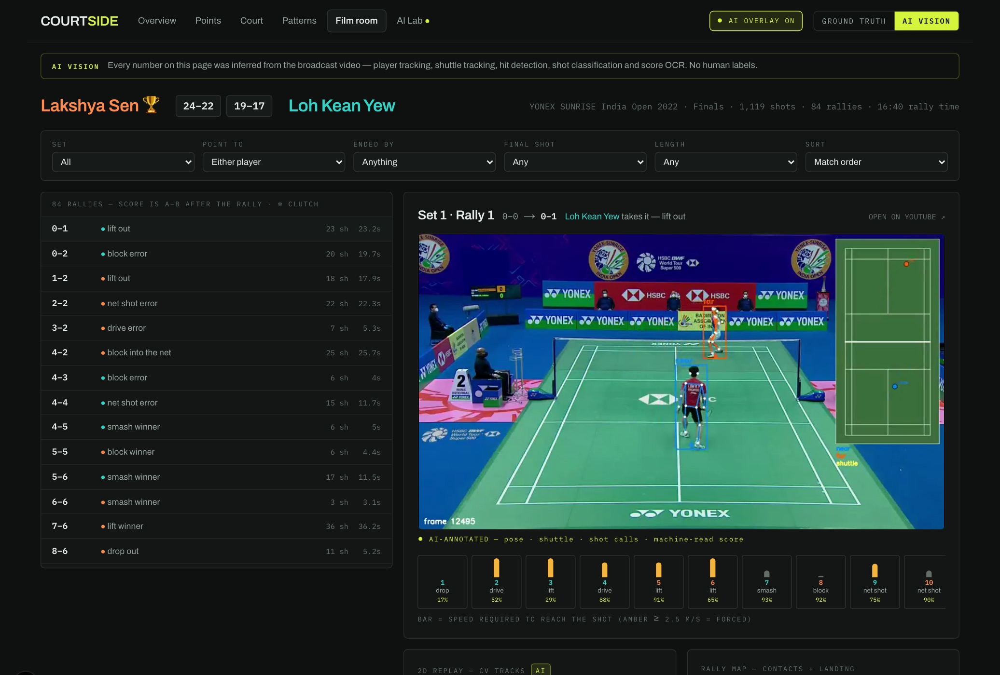

# COURTSIDE: badminton match analytics from broadcast video

An end-to-end computer-vision pipeline that turns a badminton broadcast into per-shot match
data. It tracks both players and the shuttle, detects every hit, classifies every shot,
reads the scoreboard and segments rallies, then serves the result as an analytics dashboard
with an annotated clip for every rally. No human labels at inference time, and every stage
is scored against ShuttleSet22 annotations including on a held-out match.

**Live: [badminton.jaydenclim.com](https://badminton.jaydenclim.com)**



> The dashboard in label-free mode. The same views flip to **GROUND TRUTH** (human labels);
> the AI Lab page publishes the measured gap between the two.

## Pipeline accuracy

Thresholds were tuned on one match (India Open 2022 final) and tested untouched on a
second (Denmark Open 2022 SF), so the held-out column is out-of-distribution performance.
Ground truth: ShuttleSet22 human annotations.

| Stage | Method | Tuned match | Held-out match |
|---|---|---|---|
| Player tracking → court metres | YOLO11x-pose + ByteTrack + homography | **0.57 m** median (1,058 strokes) | 0.64 m |
| Shuttle tracking | TrackNetV3 (vendored, MPS-patched) | **99.8%** of labeled hit points | — |
| Hit detection | velocity-kink ∪ direction-reversal ∪ serve-onset detectors | **F1 87.9** | F1 85.8 |
| Hitter attribution | nearest tracked wrist | **90.0%** | 94.5% |
| Landing position | trajectory floor point → homography | **0.55 m** median | 1.12 m |
| Shot classification (10 classes) | pretrained BST-0 (CVPRW'26) at *detected* hits, zero fine-tuning | **72.5%** | 83.4% |
| Rally segmentation | camera-run detection + dead-shuttle restart splitting | **F1 97.6** | F1 94.0 |
| Score OCR | template-matched 12 px digits (self-bootstrapped from labels, transfers across tournaments) | **95.2%** score trajectory | 97.3% |
| Per-set side mapping | "winner serves next" voting | **4/4** sets | 4/4 sets |

End-to-end, the label-free chain reproduces 84.5% / 79.5% of labeled strokes with ~96%
hitter agreement, so the same analytics code produces near-identical output from either
source.

## Dashboard

Static Next.js app in [`web/`](web/) (TypeScript, Tailwind, hand-built SVG charts, no chart
library; deploys to Vercel as pure static files):

- **Overview:** score progression, player comparison, auto-generated coach's notes where
  every claim deep-links to its evidence rallies, plus an LLM-written match report.
- **Points / Court / Patterns:** winners and errors by shot, rally-length win rates, serve
  and receive, shot placement maps, movement heatmaps (side-swap corrected), a pressure
  model (required movement speed), forced vs unforced errors, and two scouting tables: the
  response matrix (what a player does against each incoming shot, and how often it works)
  and the opening playbook (serve type → hold % → returns → server win % vs each).
- **Film room:** every rally filterable and watchable, with a synchronized 2D replay
  animated from the CV tracks and a per-shot pressure strip.
- **AI overlay:** a navbar toggle swaps all footage to pre-rendered annotated clips with
  pose skeletons, shuttle trail, shot calls with confidence, and the machine-read score
  baked into the video.
- **AI Lab:** every pipeline stage with its measured accuracy, a per-rally breakdown
  (broadcast + 2D replay + raw shuttle trajectory with detected vs labeled hits), live
  score-OCR crops, and the shot-classification confusion matrix.




## Doubles

A separate, deletable surface (route `/d/<id>`, its own manifest and components) so the
singles chain stays untouched. There are no public doubles stroke labels and identical kit
defeats appearance re-ID, so this pipeline works from **geometry and roles** rather than
strokes: all four players tracked (top-2 per court half, stable identity slots), and from
the tracks alone, formation (attack = front/back stack vs defence = side-by-side),
rotations, net-hunting, movement heatmaps and label-free validation (≈93% all-4 in-rally
coverage). Set boundaries come from the scoreboard OCR and the pairs' end-swaps between
games are handled deterministically, so every stat aggregates per **team** across a full
multi-set match.

Five views: Overview, Court, Patterns, Film room, AI Lab. Shot mix, response matrix,
openings and error pressure need 4-slot hit attribution and are not built yet. Runbook and
design: [`docs/DOUBLES.md`](docs/DOUBLES.md).

## Run it

**Web dashboard.** All data and clips are committed, so it runs from a fresh clone:

```bash
cd web && npm install && npm run dev     # http://localhost:3000
npm run build                            # static site in web/out (Vercel: root dir = web)
```

**Python pipeline / Streamlit lab.** Needs the local DuckDB and match video, built by the
runbook below:

```bash
python3.12 -m venv .venv && .venv/bin/pip install -r requirements.txt
PYTHONPATH=src .venv/bin/streamlit run app.py        # internal CV-diagnostics dashboard
PYTHONPATH=src .venv/bin/python -m badminton.<module>  # any pipeline stage as a CLI
```

**Add a match.** Full runbook in [`docs/ADD_A_MATCH.md`](docs/ADD_A_MATCH.md). The short
version, for any broadcast video with no labels:

```bash
# register in config/matches.yaml, fetch 720p video, calibrate 4 court corners, then:
PYTHONPATH=src .venv/bin/python scripts/parse_match.py --match <id> ...   # player tracks
PYTHONPATH=src .venv/bin/python -m badminton.shuttle <id>                 # shuttle track
PYTHONPATH=src .venv/bin/python -m badminton.pipeline <id> --label-free --write
PYTHONPATH=src .venv/bin/python -m badminton.labelfree <id> --build       # score OCR
PYTHONPATH=src .venv/bin/python scripts/render_web_clips.py --match <id>  # AI clips
PYTHONPATH=src .venv/bin/python -m badminton.export_web                   # → web/public/data
```

Parsed data is durable (DuckDB, keyed by `match_id`), so every stage runs once and is
cached from then on.

## How it's built

```
broadcast.mp4 ──► YOLO11 pose + ByteTrack ──► tracks (court metres, validated ±0.57 m)
       │                                          │
       └──► TrackNetV3 ──► shuttle track ──► hit detection ──► BST-0 shot classes
                                │                 │
                       rally segmentation   landings (floor-point → homography)
                                │                 │
       score OCR ──► winners · sets · sides       │
                                └────────┬────────┘
                                  strokes table (= ShuttleSet schema, source='pipeline')
                                         │
                    insights.py / labelfree.py (pure pandas analytics)
                                         │
                         export_web.py ──► static JSON ──► web/ (Next.js)
```

The core design decision: **ShuttleSet's annotation format is the system's Tier-1
schema.** The CV pipeline's job is defined as *reproducing the human annotators' table*,
which gives free per-stage validation and let the entire analytics layer be built and
debugged on ground truth before the vision pipeline existed.

- **Storage:** DuckDB, two tiers. `strokes` (one row per shot, superset of ShuttleSet) and
  `tracks`/`shuttle` (per-frame). One writer or many readers; writers batch at the end.
- **Stack:** Python 3.12 / PyTorch on Apple-silicon MPS, ultralytics, DuckDB, pandas,
  scikit-learn, OpenCV · Next.js 16 / TypeScript / Tailwind 4 · Gemini or Claude for the
  commentary layer (cached JSON, pluggable provider).
- **Video strategy:** analyzed videos are the official BWF YouTube uploads, so the web app
  embeds them at frame-accurate timestamps (zero hosting); the AI-annotated clips are
  rendered locally at 540p (~0.7 MB/rally) and shipped with the site.

## Credits

Four pretrained third-party models, used without fine-tuning:
[Ultralytics YOLO11-Pose](https://github.com/ultralytics/ultralytics) (player pose),
[ByteTrack](https://arxiv.org/abs/2110.06864) (identity, via Ultralytics' bundled tracker),
[TrackNetV3](https://github.com/qaz812345/TrackNetV3) (shuttle trajectory, vendored and run
unmodified), and [BST-0](https://arxiv.org/abs/2502.21085) (*Badminton Stroke-type
Transformer*, Chang, CVPRW 2026). Ground truth and the Tier-1 schema come from the
[ShuttleSet / ShuttleSet22](https://github.com/wywyWang/CoachAI-Projects) annotations.

Everything between those models lives in this repo: hit detection, landing estimation,
rally segmentation, score OCR and decoding, side mapping, the analytics and dashboard
layers, homography calibration and the foot-point heuristic, MPS shims for the vendored
models, the BST input adapter, and the validation harness. The method column in the
accuracy table says which of the two produced each number.

### Licenses

COURTSIDE's own code is [MIT](LICENSE). Third-party models, data and libraries keep their
own licenses. Read [`LICENSES/README.md`](LICENSES/README.md) before redistributing
anything or deploying the pipeline as a network service.

| Component | Role | License |
|---|---|---|
| [YOLO11-Pose / Ultralytics](https://github.com/ultralytics/ultralytics) | player detection + pose | ⚠️ [AGPL-3.0](https://github.com/ultralytics/ultralytics/blob/main/LICENSE) — copyleft incl. network use; weights gitignored, never redistributed here |
| [ByteTrack](https://github.com/ifzhang/ByteTrack) | player identity across frames | [MIT](https://github.com/ifzhang/ByteTrack/blob/main/LICENSE) upstream; the implementation actually run is Ultralytics' bundled tracker, so it ships under AGPL-3.0 |
| [TrackNetV3](https://github.com/qaz812345/TrackNetV3) | shuttle trajectory | [MIT](third_party/TrackNetV3/LICENSE) (vendored, unmodified) |
| [BST-0](https://github.com/Va6lue/BST-Badminton-Stroke-type-Transformer) ([paper](https://arxiv.org/abs/2502.21085)) | stroke-type classification | [MIT](third_party/BST/LICENSE) (vendored) |
| [ShuttleSet / ShuttleSet22](https://github.com/wywyWang/CoachAI-Projects) | ground-truth annotations, Tier-1 schema | [MIT](https://github.com/wywyWang/CoachAI-Projects/blob/main/LICENSE), cite the ShuttleSet paper in published results |

Runtime libraries are standard permissive (PyTorch BSD-3, OpenCV Apache-2.0, DuckDB MIT,
pandas / NumPy / scikit-learn BSD, Next.js / React / Tailwind MIT), itemized in
[`LICENSES/README.md`](LICENSES/README.md).

## Docs

| Doc | Contents |
|---|---|
| [`HANDOFF.md`](HANDOFF.md) | single entry point: status, module map, the hard-won gotchas |
| [`docs/DOUBLES.md`](docs/DOUBLES.md) | doubles workstream: 4-player tracking, formation/roles, full-match multi-set dashboard |
| [`docs/ADD_A_MATCH.md`](docs/ADD_A_MATCH.md) | runbook: inject a new match (labeled or label-free) |
| [`docs/DESIGN.md`](docs/DESIGN.md) · [`docs/SCHEMA.md`](docs/SCHEMA.md) | architecture & the two-tier data model |
| [`docs/PHASE0_RESULTS.md`](docs/PHASE0_RESULTS.md) | tracking validation methodology + results |
| [`docs/WEBAPP_DESIGN.md`](docs/WEBAPP_DESIGN.md) | every dashboard view & component, design rationale |
| [`docs/DATASETS.md`](docs/DATASETS.md) | ShuttleSet & friends, how to access |
